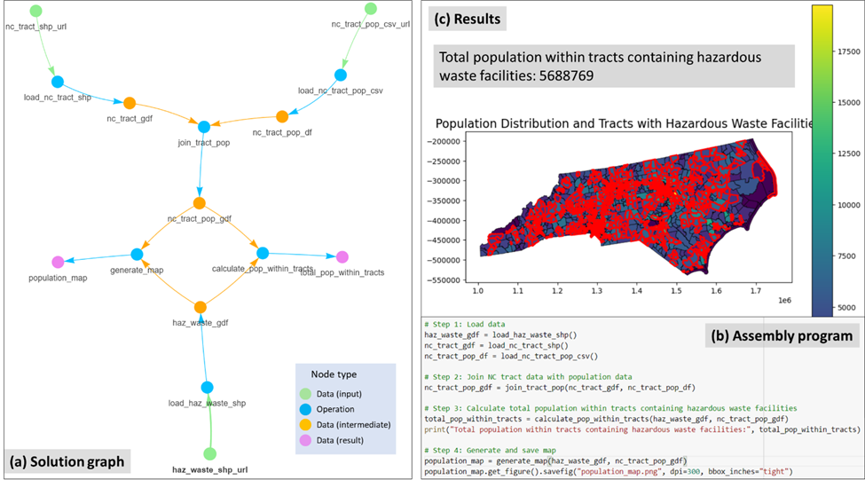
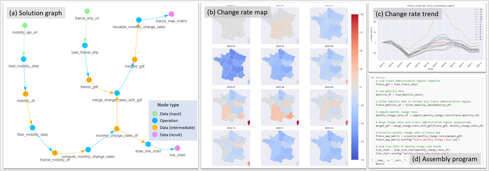

# Autonomous GIS (AutoGIS): the next-generation AI-powered GIS

GIS stands for Geographic Information System; one of its major functionality is to conduct spatial analysis, manually, in the current stage. Large Language Models (LLMs), such as ChatGPT, demonstrate a strong understanding of human natural language and have been explored and applied in various fields, including reasoning, creative writing, code generation, translation, and information retrieval. 

By adopting LLM as the reasoning core, we introduce Autonomous GIS, an AI-powered geographic information system (GIS) that leverages the LLM’s general abilities in natural language understanding, reasoning and coding for addressing spatial problems with automatic spatial data collection, analysis and visualization. We envision that autonomous GIS will need to achieve five autonomous goals including **self-generating, self-organizing, self-verifying, self-executing, and self-growing**. We developed a prototype system called LLM-Geo using GPT-4 API in a Python environment, demonstrating what an autonomous GIS looks like and how it delivers expected results without human intervention using two case studies. 

For two case studies, LLM-Geo successfully returned accurate results, including aggregated numbers, graphs, and maps, significantly reducing manual operation time. Although still lacking several important modules such as logging and code testing, LLM-Geo demonstrates a potential path towards next-generation AI-powered GIS. We advocate for the GIScience community to dedicate more effort to the research and development of autonomous GIS, making spatial analysis easier, faster, and more accessible to a broader audience. 


Overall workflow of LLM-Geo

Check out our preprint paper here: [Autonomous GIS: the next-generation AI-powered GIS](https://www.researchgate.net/publication/370635187_Autonomous_GIS_the_next-generation_AI-powered_GIS). Recommended citation format: Li Z., Ning H., 2023. Autonomous GIS: the next-generation AI-powered GIS. arXiv.2305.06453

Note:  We are still developing LLM-Geo, and the ideas presented in the paper may change due to the rapid development of AI. For instance, the token limitation appears to have been overcome by [Claude](https://www.anthropic.com/index/100k-context-windows) (released on 2023-05-11). We hope LLM-Geo can inspire GIScience professionals to further investigate more on autonomous GIS.    

# Installation

Clone or download the repository, rename `your_config.ini` as `config.ini`. Then put your OpenAI API key in the `config.ini` file. Please use GPT-4, the lower versions such as 3.5 do no have enougth reasoning ability to generate correct solution graph and operation code.

If you have difficulties to install `GeoPandas` in Windows, refer to this [post](https://geoffboeing.com/2014/09/using-geopandas-windows/). 


# How to use
- Download all files, put your question to the `TASK` variable in LLM-Geo4.ipynb.
- Set the `task_name` in the notebook. Space is not allowed. LLM-Geo will create the fold using the `task_name` to save results.
- Run all cells.
- LLM-Geo will use the backed LLM (GPT-4 now) to review and debug the generated program. GPT-4's debugging ability is still weak. The default maximum attempt count is set to 10, modify this value is needed. 
- Note that solution based on graph, code review, and debug will cost a lot of tokens. We provide a Jupyter notebook [(Direct_request_LLM.ipynb)](https://github.com/gladcolor/LLM-Geo/blob/master/Direct_request_LLM.ipynb) to directly request solutions from LLM. This is a much more quick way to get solutions for simple tasks/questions, but its robustness may slightly lower.

# Case studies
These case studies are carefully designed to show the concepts of autonomous GIS. Please use GPT-4; the lower version of GPT will fail to generate correct code and results. Note everytime GPT-4 generate different outputs, so your results may look different. Per our test, the generated program may not success everytime, but there is 80% chance to run successfully. If input the generated prompts to the ChatGPT-4 chat box rather than API, the success rate will be much higher. We will improve the overall workflow of LLM-Geo, currently we do not push the entire historical conversation (i.e., sufficient information) to the GPT-4 API.

Video demonstrations for the case studies

Case 1: https://youtu.be/ot9oA_6Llys

Case 2: https://youtu.be/ut4XkMcqgvQ

Case 3: https://youtu.be/4q0a9xKk8Ug

## Case 1: Counting population living near hazardous wastes.
This spatial problem is to find out the population living with hazardous wastes and map their distribution. The study area is North Carolina, United States (US). We input the task (question) to LLM-Geo as:
```
Task:
1) Find out the total population that lives within a tract that contain hazardous waste facilities. The study area is North Carolina, US.
2) Generate a map to show the spatial distribution of population at the tract level and highlight the borders of tracts that have hazardous waste facilities.

Data locations: 
1. NC hazardous waste facility ESRI shape file location: https://github.com/gladcolor/LLM- Geo/raw/master/overlay_analysis/Hazardous_Waste_Sites.zip
2. NC tract boundary shapefile location: https://github.com/gladcolor/LLM-Geo/raw/master/overlay_analysis/tract_shp_37.zip. The tract id column is 'Tract'
3. NC tract population CSV file location: https://github.com/gladcolor/LLM-Geo/raw/master/overlay_analysis/NC_tract_population.csv. The population is stored in 'TotalPopulation' column. The tract ID column is 'GEOID'
```
The results are: (a) Solution graph, (b) assembly program (Python codes), and (c) returned population count and generated map. 



## Case 2: Human mobility data retrieval and trend visualization.
This task is to investigate the mobility changes during COVID-19 pandemic in France 2020. First, we asked LLM-Geo to retrieve mobility data from the ODT Explorer using [REST API](https://github.com/GIBDUSC/ODT_Flow), and then compute and visualize the monthly change rate compared to January 2020. We input the task (question) to LLM-Geo as:
```
Task: 
1) Show the monthly change rates of population mobility for each administrative regions in a France map. Each month is a sub-map in a map matrix. The base of the change rate is January 2020. 
2) Draw a line chart to show the monthly change rate trends of all administrative regions.

Data locations: 
1. ESRI shapefile for France administrative regions: https://github.com/gladcolor/LLM-Geo/raw/master/REST_API/France.zip. The 'GID_1' column is the administrative region code, 'NAME_1' column is the administrative region name.
2. REST API URL with parameters for mobility data access: http://gis.cas.sc.edu/GeoAnalytics/REST?operation=get_daily_movement_for_all_places&source=twitter&scale=world_first_level_admin&begin=01/01/2020&end=12/31/2020. The response is in CSV format. There are three columns in the response: place, date (format:2020-01-07), and intra_movement. 'place' column is the administrative region code, France administrative regions start with 'FRA'.
```
The results are: (a) Solution graph, (b) map matrix showing the spatial distribution of mobility change rate, (c) line chart showing the trend of the mobility change rate, (d) assembly program. 


Note: The ODT explorer API needs to be woken up before being used. Simple open this URL: [http://gis.cas.sc.edu/GeoAnalytics/od.html](http://gis.cas.sc.edu/GeoAnalytics/od.html) in your browser, then fresh the webpage until you see the flows counts like bellow:
 

## Case 3: COVID-19 death rate analysis and visualization at the US county level.
The spatial problem for this case is to investigate the spatial distribution of the COVID-19 death rate (ratio of COVID-19 deaths to cases) and the association between the death rate and the proportion of senior residents (age >=65) at the US county level. The death rate is derived from the accumulated COVID-19 data as of December 31, 2020, available from New York Times (2023), based on state and local health agency reports. The population data is extracted from the 2020 ACS five-year estimates (US Census Bureau 2022). The task asks for a map to show the county level death rate distribution and a scatter plot to show the correlation and trend line of the death rate with the senior resident rate. We input the task (question) to LLM-Geo as:
```
Task:
1) Draw a map to show the death rate (death/case) of COVID-19 among the countiguous US counties. Use the accumulated COVID-19 data of 2020.12.31 to compute the death rate. Use scheme ='quantiles' when plotting the map.  Set map projection to 'Conus Albers'. Set map size to 15*10 inches.  
2) Draw a scatter plot to show the correlation and trend line of the death rate with the senior resident rate, including the r-square and p-value. Set data point transparency to 50%, regression line as red.  Set figure size to 15*10 inches.  

Data locations:
1) COVID-19 data case in 2020 (county-level): https://github.com/nytimes/covid-19-data/raw/master/us-counties-2020.csv. This data is for daily accumulated COVID cases and deaths for each county in the US. There are 5 columns: date (format: 2021-02-01), county, state, fips, cases, deaths. 
2) Contiguous US county boundary (ESRI shapefile): https://github.com/gladcolor/spatial_data/raw/master/contiguous_counties.zip. The county FIPS column is 'GEOID'.
3) Census data (ACS2020): https://raw.githubusercontent.com/gladcolor/spatial_data/master/Demography/ACS2020_5year_county.csv. The needed columns are: 'FIPS', 'Total Population', 'Total Population: 65 to 74 Years', 'Total Population: 75 to 84 Years', 'Total Population: 85 Years and Over'.

```
The results are: (a) Solution graph, (b) county level death rate map of the contiguous US, (c) scatter plot showing the association between COVID-19 death rate and the senior resident rate at the county level, (d) assembly program.  


# To Do
- Add more case studies.
- Improve the prompt generation.
- Implement autonomous data understanding module.
- Implement autonomous data collection module.
- Develop a web-based front-end user inteface
- Test the integration of LLM-Geo with QGIS and ArcGIS.

# Note:
In our intensive testing in Oct. 2023, we found that GPT-4 return correct code in a lower success rate. Anyone using LLM-Geo may need to run it multiple time with the debugging function turned on. We will continue to improve LLM-Geo, and please send us a pull request if you have any improvement! Thank you!